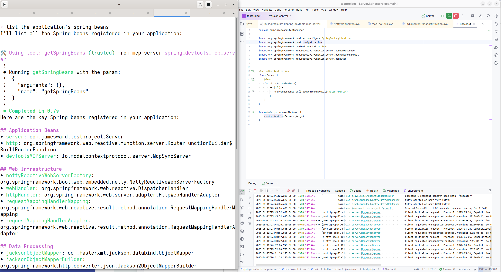

# Spring DevTools MCP Server

An MCP (Model Context Protocol) server for Spring developers that provides tools for AI assistants to query information about a running Spring application.



## Setup

Add this to your Gradle build:
```
developmentOnly("com.jamesward:spring-devtools-mcp-server:0.0.1")
```

Then run your Spring app and point your code assistant to `http://localhost:9999/sse`

If your code assistant doesn't support SSE MCP servers, use `uvx` and the `mcp-proxy`:
```
uvx mcp-proxy http://localhost:9999/sse
```

## Todo

- Configurable port
- Logging
- Test Spring devtools reload stuff
- Add more tools (properties, web routes, etc)
- Contribute to the official Spring devtools
